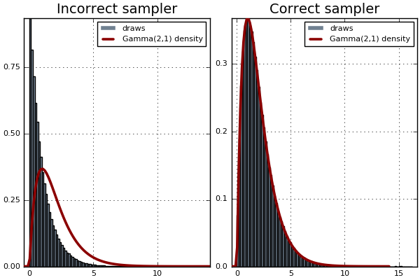

# BayesianTools.jl
[](https://travis-ci.org/gragusa/BayesianTools.jl)
[](https://coveralls.io/github/gragusa/BayesianTools.jl?branch=master)
[](http://codecov.io/github/gragusa/BayesianTools.jl?branch=master)

`BayesianTools.jl` is a Julia package with methods useful for Monte Carlo Markov Chain simulations. The package has two submodules:

- `ProductDistributions`: defines a `ProductDistribution` type and related methods useful for defining and evaluating independent priors
- `Link`: usuful rescale MC proposals to the parameter space of the underlying prior

## Installation

The package is not registered, so it must be cloned:
```julia
Pkg.clone("https://github.com/gragusa/BayesianTools.jl.git")
```

## Usage

### ProductDistributions

The following code shows how a product distribution resulting from multiplying a normal and a Beta can be obtained
```julia
using BayesianTools.ProductDistributions
p = ProductDistribution(Normal(0,1), Beta(1.,1.))
n = length(p) ## 2 -> Number of distribution in the product
```
To check whether an `Array{Float64}` is in the support of `p`
```julia
insupport(p, [.1,2.]) ## false
insupport(p, [.1,1.]) ## true
```
The `logpdf` and the `pdf` at a point `x::Array{Float64}(n)` are
```julia
logpdf(p, [.1,.5]) # = logpdf(Normal(0,1), .1) + logpdf(Beta(1.,1.), .5)
pdf(p, [.1,.5]) # = pdf(Normal(0,1), .1) * pdf(Beta(1.,1.), .5)
```

It is also possible to draw a sample from `p`
```julia
rand!(p, Array{Float64}(2,100))
```

### Links

`invlink` and `link` are useful to transform and transform back the parameters of a model according to the support of a distribution. `logjacobian` provides the log absolute Jacobian of the inverse transformation applied by `invlink`.

The typical use case of the methods in the `Links` is best understood by an example. Suppose interest lies on sampling from a Gamma(2,1) distribution


 This is a simple distribution, and there are many straightforward ways to simulate it directly, but  we will employ a random walk Metropolis-Hastings (MH) algorithm with standard Gaussian proposal.

Since the support of this distribution is x > 0, there are four options regarding the proposal distribution:

1. Use a Normal(0,1) and proceed as you normally would if the support of the density was (-Inf, +Inf).

2. Use a truncated normal distribution as proposal
3. Sample from a Normal(0,1) until the draw is positive

4. Re-parametrise the distribution in terms of  that is to sample from


The first strategy will work just fine as long as the density evaluates to 0 for values outside its support. This is the case for the `pdf` of a `Gamma` in the `Distributions` package.

The second and the third strategy is going to work _as long as the acceptance ratio_ includes the normalising constant (see [Darren Wilkinson's post](https://darrenjw.wordpress.com/2012/06/04/metropolis-hastings-mcmc-when-the-proposal-and-target-have-differing-support/)).

The last strategy also needs an adjustment to the acceptance ratio to incorporate the Jacobian of the transformation.

The code below use `invlink`, `link`, and `logjacobian` to carry out the r.v. transformation and the Jacobian adjustment.

Notice that the `Improper` distribution is a subtype of `ContinuousUnivariateDistribution`. `Links` defines methods for `Improper` that allow the transformations to go through automatically. (`Improper` can also be used as component of the `ProductDistribution` which is useful if an improper prior was elicited for some components of parameter.)

 ```julia
 using BayesianTools.Links
 function mcmc_wrong(iters)
    chain = Array{Float64}(iters)
    gamma = Gamma(2, 1)
    d = Improper(0, +Inf)
    lx  = 1.0
    for i in 1:iters
       xs = link(d, lx) + randn()
       lxs = invlink(d, xs)
       a = logpdf(gamma, lxs)-logpdf(gamma, lx)       
       (rand() < exp(a)) && (lx = lxs)
       chain[i] = lx
    end
    return chain
end
 function mcmc_right(iters)
    chain = Array{Float64}(iters)
    gamma = Gamma(2, 1)
    d = Improper(0, +Inf)
    lx  = 1.0
    for i in 1:iters
       xs = link(d, lx) + randn()
       lxs = invlink(d, xs)
       a = logpdf(gamma, lxs)-logpdf(gamma, lx)
       ## Log absolute jacobian adjustment
       a = a - logjacobian(d, lxs) + logjacobian(d, lx)
       (rand() < exp(a)) && (lx = lxs)
       chain[i] = lx
    end
    return chain
end
```

The results is
```julia
mc0 = mcmc_wrong(1_000_000)
mc1 = mcmc_right(1_000_000)
using Plots
Plots.histogram([mc0, mc1], normalize=true, bins = 100, fill=:slategray, layout = (1,2), lab = "draws")
title!("Incorrect sampler", subplot = 1)
title!("Correct sampler", subplot = 2)
plot!(x->pdf(Gamma(2,1),x), w = 2.6, color = :darkred, subplot = 1, lab = "Gamma(2,1) density")
plot!(x->pdf(Gamma(2,1),x), w = 2.6, color = :darkred, subplot = 2, lab = "Gamma(2,1) density"))
png("sampler")
```


